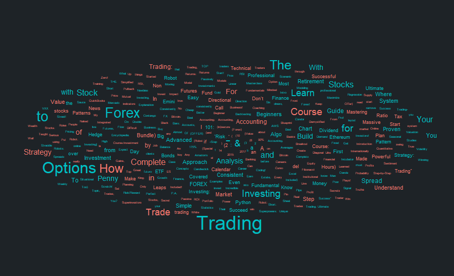

# Udemy Analysis

My objective here is to do a complete analysis - Predictive, exploratory and inferential - utilizing a small database from udemy courses informations. One of the biggest problems faced by data professionals is data availability, and I would like to start under this circumstance. Hence, how challanging is to work under this environment? Which value can I extract from it? How does the ML models faced this specific situation? Well, let's see.

*You are free to run your own notebook (I am using the Google Colab, you do not need to clone), just use your kaggle authetincation*

I got the database from: https://www.kaggle.com/datasets/andrewmvd/udemy-courses (Thank you! @LARXEL)

Feel free to contact me by [LinkedIn](https://www.linkedin.com/in/m-mca/) or Email (matheusmca07@gmail.com) if you saw any error, have some tip, or even a suggestion. 

## Analysis Division
I have done this three analysis. My goals here are to come up with something that will help Udemy to optimize its services and functionalities, boosting the revenues.

### Predictive Analysis

After published some content in the platform, how creators may adjust their price? As time pass, new contents are being created, which means there are a broad range of new courses to choose. **How can we create a more competitive enviroment?** **How can we help the content creators to adjust their prices more effectively?** **And what are the benefits for them, their clients and udemy itself?**

---
Our objective here is to predict the price for a course based on other similar courses, creating a competitive environment. Thus, the content creator will be able to compare his price with the "market price" (the benchmark) - since the model is based on market prices -. *This is going to help them to adjust their prices based on their competitors, optimizing their sales.*

---
**Benefits:**
1. Sales optimizer: Knwoing the fair price, individuals are able to try competitive strategies such as lowering their prices to catch more costumers and achieve higher profits (scaling by sales);
2. Quality Booster: A more competitive environment tends to increase the quality of the contents that are posted. It creates better contents, increasing the likelihood of new purcheses by the same client as well as new clients;
3. Greater the sales, greater the revenue: Optimize the content market is equivalent to optimize the revenue.

### Exploratory Analysis

On progress... 
