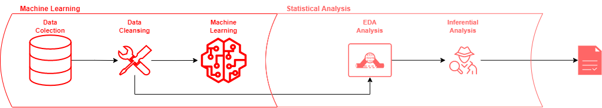
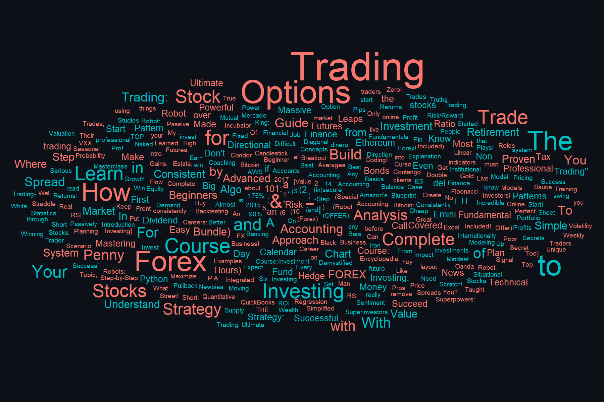

# Udemy Analysis

| Idioms | Idiomas |
|-----------|---------|
|English | Inglês  |
|Portuguese | Português |

**English**

The objective here is to do a complete analysis - Predictive, exploratory and inferential - utilizing a small data set from Udemy. One of the biggest problems faced by data professionals is data availability and I would like to start under this circumstance. Hence, how challenging is it to work under this environment? Which value can is possible to extract from it? How do Machine Learning models face this specific situation? Well, let's see.

*You are free to run your own notebook (I am using the Google Colab, you do not need to clone), just use your Kaggle authentication and the .csv*

I got the data set from: https://www.kaggle.com/datasets/andrewmvd/udemy-courses (Thank you! @LARXEL)

Feel free to contact me by [LinkedIn](https://www.linkedin.com/in/m-mca/) or Email (matheusmca07@gmail.com) whether you saw any error, have some tip, or even a suggestion. 

**Português**

O objetivo aqui é realizar uma análise completa - Preditiva, exploratória e inferencial - utilizando um pequeno conjunto de dados da Udemy. Um dos grandes problemas encontrados pelos profissionais de dados é a falta de dados e eu gostaria de iniciar sob essa circunstância. Portanto, quão desafiador é trabalhar neste ambiente? Que valor é possível extrair dele? Como os modelos de Aprendizado de Máquina lidam com esse tipo de situação? Vamos ver!

*Você pode rodar o código utilizando seu próprio notebook (Use o colab, não precisa clonar), somente use sua autenticação do Kaggle e o .csv*

Consegui o conjunto em: https://www.kaggle.com/datasets/andrewmvd/udemy-courses (Obrigado! @LARXEL)

Fale comigo por [LinkedIn](https://www.linkedin.com/in/m-mca/) ou E-mail (matheusmca07@gmail.com) se você encontrar qualquer erro, tem alguma dica, ou até mesmo sugestão.

# English
## Analysis Division
I have done these three analyses. My goals here are to come up with something that will help Udemy to optimize its services and functionalities, boosting the revenues.

### Predictive Analysis

After publishing some content on the platform, how do creators adjust their prices? As time passes, new contents are being created, which means there are a broad range of new courses to choose from. **How can we create a more competitive environment?** **How can we help the content creators to adjust their prices more effectively?** **And what are the benefits for them, their clients and udemy itself?**

---
The objective here is to predict the price for a course based on other similar courses, creating a competitive environment. Thus, the content creator will be able to compare his price with the "market price" (the benchmark) - since the model is based on market prices -. *This is going to help them to adjust their prices based on their competitors, optimizing their sales.*

---
**Benefits:**

🔸 Sales optimizer: Knowing the fair price, individuals are able to try competitive strategies such as lowering their prices to catch more customers and achieve higher profits (scaling by sales);

🔸 Quality Booster: A more competitive environment tends to increase the quality of the contents that are posted. It creates better contents, increasing the likelihood of new purchases by the same client as well as new clients;

🔸 Greater the sales, greater the revenue: Optimize the content market is equivalent to optimize the revenue.

### Exploratory Analysis

🔸What strategies do Udemy's content creators use to catch more customers and get more sales? What are their prices strategies?

🔸What tools a graphic designer or a web developer will probably have today?

🔸What is the most popular work area?

🔸When courses' prices are at the bottom or at the top (Sazonality)? Why?

🔸Can we expect more Front-End than Back-End developers in a few years? What tools will everyone have?

---
These questions and a few more are answered using that small dataset with just a few pieces of information. Economic theory was used to explain some situations as well as behaviors.

**These answers and questions are find at "eda_analysis" folder.**

*Remember, this is a study case with just a small sample size.*

### Inferential Analysis

---

# Português
## Análises

### Análise Preditiva

Depois de publicar algum conteúdo na plataforma, como os criadores ajustam seus preços? Com o passar do tempo, novos conteúdos estão sendo criados, o que significa que há uma ampla variedade de novos cursos para escolher. Como podemos criar um ambiente mais competitivo? Como podemos ajudar os criadores de conteúdo a ajustar seus preços de forma mais eficaz? **E quais são os benefícios para eles, seus clientes e a própria Udemy?**

---
O objetivo aqui é prever o preço de um curso com base em outros cursos semelhantes, criando um ambiente competitivo. Assim, o criador de conteúdo poderá comparar seu preço com o "preço de mercado" (referência), uma vez que o modelo é baseado em preços de mercado. *Isso vai ajudá-los a ajustar seus preços com base em seus concorrentes, otimizando suas vendas.*

---
**Benefícios:**

🔸 Otimizador de vendas: Sabendo o preço justo, os indivíduos são capazes de experimentar estratégias competitivas, como reduzir seus preços para atrair mais clientes e obter lucros mais altos (escalando por vendas);

🔸 Aumento de qualidade: Um ambiente mais competitivo tende a aumentar a qualidade dos conteúdos postados. Isso cria melhores conteúdos, aumentando a probabilidade de novas compras pelo mesmo cliente, bem como de novos clientes;

🔸 Quanto maiores as vendas, maior a receita: Otimizar o mercado de conteúdo equivale a otimizar a receita.

### Análise Exploratória

🔸 Quais estratégias os criadores de conteúdo da Udemy utilizam para captar mais clientes e conseguir mais vendas? Quais são suas estratégias de preço?

🔸 Quais ferramentas que todo designer gráfico ou desenvolvedor web provavelmente terão hoje?

🔸 Qual é a área de trabalho mais popular? Finance? Tech?

🔸 Quando os preços dos cursos atingem o seu nível mais baixo ou mais alto (Sazonalidade)? Por quê?

🔸 Dentro de alguns anos a maioria das pessoas vão dominar ferramentas de Front-End (sendo a área com mais oferta de mão de obra)? Quais as ferramentas?

---
Essas questões e algumas outras são respondidas usando um pequeno conjunto de dados com apenas algumas informações. Teoria econômica foi utilizada, quando necessário, para explicar algumas situações e comportamentos.

**Essas respostans e perguntas são encontradas na pasta "eda_analysis".**

*Lembre-se, isto é um estudo de caso de somente uma pequena amostra.*
