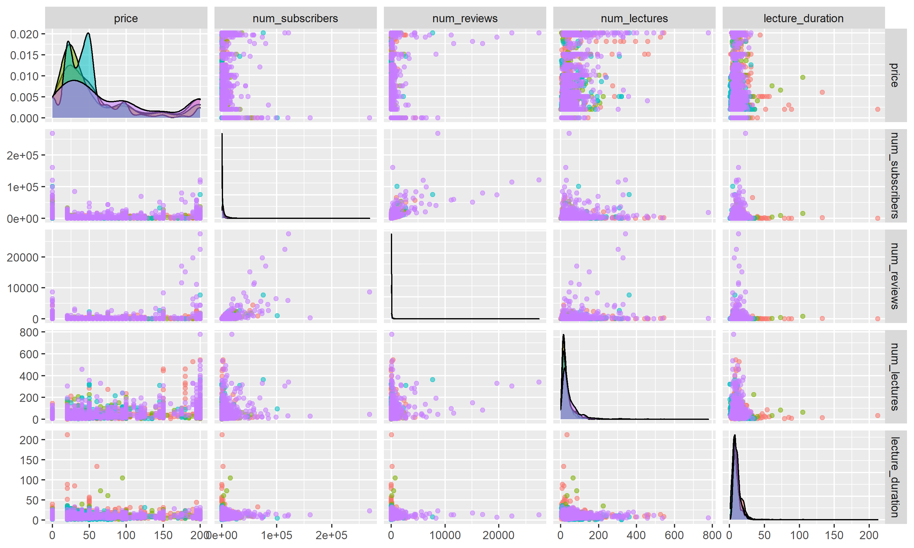
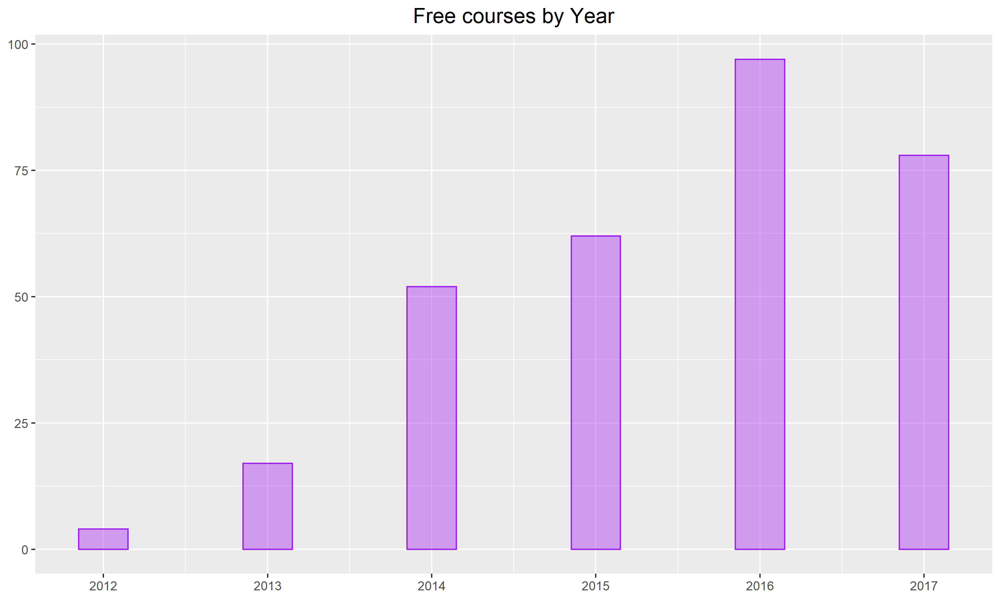
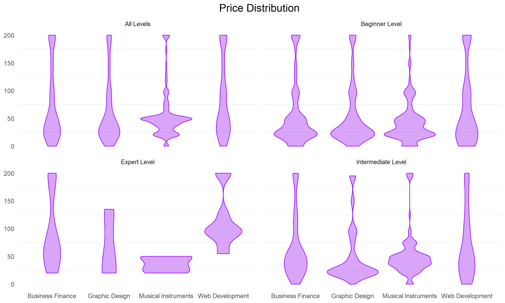
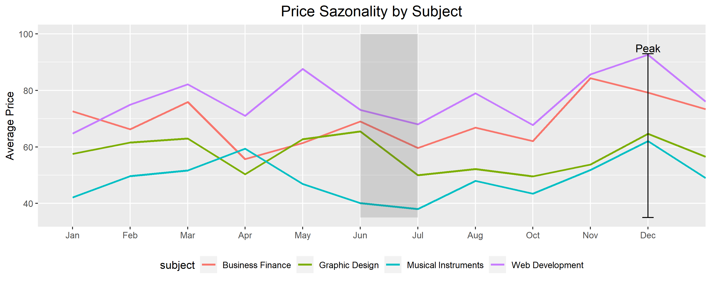
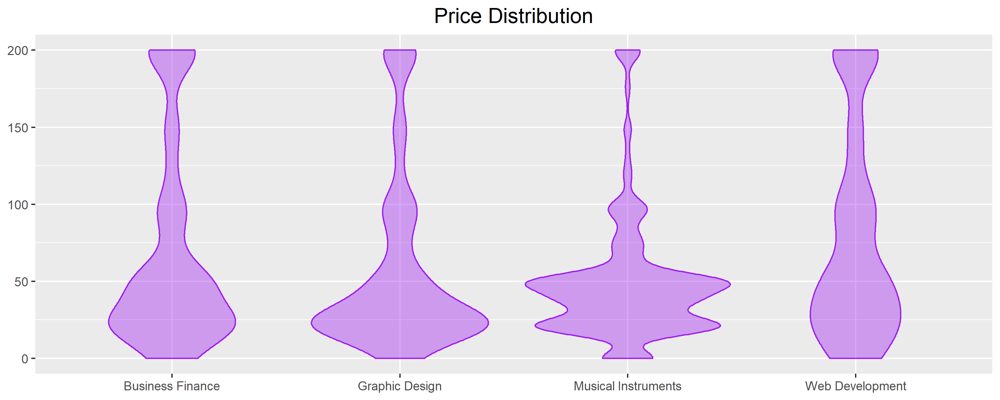
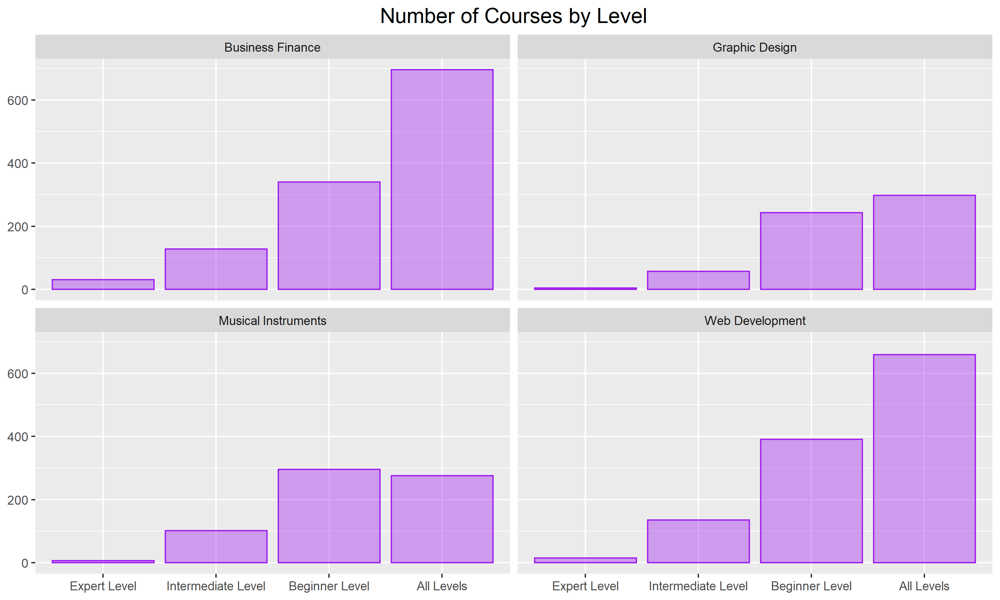

# Udemy Analytics Report (Relatório de Análise Udemy)

---

  
  
  

  
  
  

---

## English

🔹 *Charts avaliable in the "plots" folder*

### The Content Creators

Udemy's content creators seem to use free content to be a strategy to get more customers and popularity, mainly if you are new in the market.

*They usually scale their profits horizontally*, which means that they choose to maintain a lower price aiming for more sales. However, if the subject is very specific *they usually apply the vertical scaling strategy (higher prices)*, as expected.

### Seasonality

Prices are higher at the end of the year with a peak in December. There are many holidays, people are making plans and buying tools to achieve it and there is more money in the market. I can explain this using the principle derived from "Intertemporal Choice" theory: People prefer to spend their money today rather than tomorrow. Therefore, when they have the necessary money to buy something, they will do it as quickly as possible.

*If you are looking for a new course to buy try in June and July*.

There is a price limit of $200 and it is unexplainable. The only good explanation would be a price limit imposed by Udemy itself, but it does not seem like a good policy. I would question the data set reliability.

### Subjects

**For Web Development:** As observed, Expert Level courses have a higher price compared to the others. Explanations are: There is a huge demand for Web Development compared to other subjects (4x more subscribers than Finance), because there is a high demand for these professionals. Many of them are coming from other fields and usually start doing an online course; Technology is always changing; and people are expecting to get higher financial returns with this specific knowledge.

*We can expect a higher labor supply for this area in a few years*. Moreover, JavaScript was the most famous subject, followed by Wordpress, HTML, PHP, CSS, Bootstrap, Jquery and Angular. Majority of them are front-end tools. We can expect a very high offer of employees with these specific skills in the future and this is what the current employers are asking for.

**Udemy itself seems very dependent on this area (technology). They are very exposed. A policy to attract content creators from different areas should be prepared, applying the principle of diversification and minimizing their risk.**

**For Musical Instruments:** The price range is very short and has a price limit of $50. This relies on the fact that music does not change a lot over the years. Furthermore, *it is something for hobby*, not professional (for the majority of people). *Whoever buys it is not expecting financial returns.* Therefore, they are not ready to spend much money on learning music.

*Guitar is the most famous instrument* followed by piano. What I wasn't expecting is that *the third place would go to Harmonica* - I play harmonica and I do not know many people in Brazil who play it. Harmonica seems more famous in the USA and, indeed, the explanation is Blues. *Blues is the most searched musical genre.*

**For Graphic Design:** Adobe is the software that commands the market. Photoshop, Illustrator and Creative Cloud (CC) seem to be tools that every designer must domain.

**For Business and Finance:** They are usually talking about *Trading, Forex, Options, Stocks, Bitcoin, Bookkeeping and Excel.*

Whether you are not from finance, be aware that Trading, Forex and Options are the most profitables operations that you can do, but with the highest risk in the market. It got famous a while ago because of lots of propaganda on social media (I saw thousands of them in 2017). That would be a reasonable explanation for the amount of courses.

*If you are trying to work in Finance: Excel, bookkeeping and CFA are topics you should give a look.*

## Português

🔹 *Gráficos disponíveis na pasta "plots"*

### Os Criadores de Conteúdo

Os criadores de conteúdo da Udemy parecem usar conteúdo gratuito como estratégia para conseguir mais clientes e popularidade, principalmente se você é novo no mercado. *Eles geralmente ampliam seus lucros horizontalmente, o que significa que escolhem manter um preço mais baixo visando mais vendas.* No entanto, se o assunto for muito específico, eles geralmente aplicam a estratégia de ampliação vertical (preços mais altos), como esperado.

### Sazonalidade

*Os preços são mais altos no final do ano, com um pico em dezembro.* Existem muitos feriados, as pessoas estão fazendo planos e comprando ferramentas para realizá-los e há mais dinheiro no mercado. Posso explicar isso usando o princípio derivado da teoria de "Escolha Intertemporal": as pessoas preferem gastar seu dinheiro hoje em vez de amanhã. Portanto, quando elas têm o dinheiro necessário para comprar algo, farão isso o mais rápido possível.

*Se você está procurando um novo curso para comprar, tente em junho e julho.*

Existe um limite de preço de $ 200 e isso é inexplicável. A única boa explicação seria um limite de preço imposto pela própria Udemy, mas não parece uma boa política. Eu questionaria a confiabilidade do conjunto de dados.

### Assuntos

**Para Desenvolvimento Web:** Como observado, cursos de nível especialista têm um preço mais alto em comparação com os outros. As explicações são: há uma enorme demanda por Desenvolvimento Web em comparação com outros assuntos (4 vezes mais assinantes do que Finanças), porque há uma grande demanda por esses profissionais. Muitos deles vêm de outras áreas e geralmente começam fazendo um curso online; a tecnologia está sempre mudando; e as pessoas esperam obter retornos financeiros mais altos com esse conhecimento específico.

Podemos esperar um maior fornecimento de trabalho para esta área em alguns anos. Além disso, JavaScript foi o assunto mais famoso, seguido por Wordpress, HTML, PHP, CSS, Bootstrap, Jquery e Angular. A maioria deles são ferramentas front-end. Podemos esperar uma oferta muito alta de funcionários com essas habilidades específicas no futuro e isso é o que os empregadores atuais estão procurando.

**A Udemy em si parece muito dependente da área de tecnologia, muito expostos a movimentações de um só setor. Uma política para atrair criadores de conteúdo de diferentes áreas deve ser preparada, aplicando o princípio de diversificação e minimizando seu risco.**

**Para Instrumentos Musicais:** A faixa de preço é muito curta e tem um limite de preço de $ 50. Isso se baseia no fato de que a música não muda muito ao longo dos anos. Além disso, é algo para hobby, não profissional (para a maioria das pessoas). Quem compra não está esperando retornos financeiros. Portanto, não está disposto a gastar muito dinheiro aprendendo música.

*A guitarra é o instrumento mais famoso*, seguido pelo piano. O que eu não estava esperando é que *o terceiro lugar fosse para a gaita* - eu toco gaita e não conheço muitas pessoas no Brasil que tocam. A gaita parece ser mais famosa nos Estados Unidos e, de fato, a explicação é o Blues. *Blues é o gênero musical mais pesquisado.*

**Para Design Gráfico:** a Adobe é o software que comanda o mercado. *Photoshop, Illustrator e Creative Cloud (CC) parecem ser ferramentas que todo designer deve dominar.*

**Para Negócios e Finanças:** Eles geralmente falam sobre *Trading, Forex, Opções, Ações, Bitcoin, Contabilidade e Excel.*

Se você não é da área de finanças, esteja ciente de que Trading, Forex e Opções são as operações mais rentáveis que você pode fazer, mas com o maior risco do mercado. Ele se tornou famoso há algum tempo por causa de muita propaganda nas redes sociais (vi milhares delas em 2017). Essa seria uma explicação razoável para a quantidade de cursos.

*Se você está tentando trabalhar em Finanças: Excel, contabilidade e CFA são tópicos que você deve dar uma olhada.*

